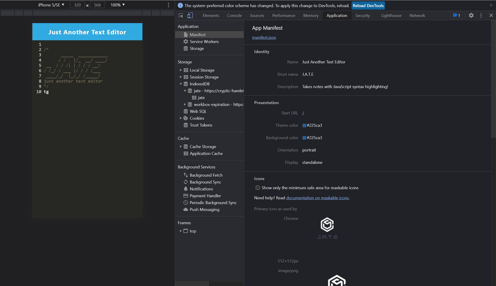

# RYK-PWA-TEXT-EDITOR

## User Story

```md
AS A coding rookie
I WANT to create an alternative method to jot down coding notes than to use my preexisting mac notepad
SO THAT I can retrieve personalized coding notes from my own app 
```

## Acceptance Criteria

```md
GIVEN my PWA application
WHEN I open my application in visual studio code
THEN I should see client server folder 
WHEN I run `npm run start` from the root directory `package.json`
THEN I find that my application should starts up both my client and server
WHEN I run my application
THEN I my webpack successfully bundles up with my JavaScript files 
WHEN I run the plugins in my webpack
THEN I successfully generate the following - HTML file, service worker, and a manifest file
WHEN I use next-gen JavaScript 
THEN I my text editor still works without errors
WHEN I open the text editor
THEN I am able to spot newly created database storage in IndexedDB which can be retrieved later on
WHEN I click on Install in the HTML 
THEN my PWA application is downloaded without error in my desktop
WHEN I load my web application
THEN I should have a registered service worker using workbox followed by pre cached static assets 
WHEN I deploy to Heroku
THEN I should have a function PWA application
```

## Screenshots

* My demo

* My idb

* My service worker

* My manifest


## Deployment

* [GitHub Repository](https://github.com/leanonruthie/RYK-PWA-Text-Editor.git)
* [Heroku](https://git.heroku.com/young-retreat-36403.git)

### Work References

* 28-Stu_Mini-Project
* Free Tutoring Session and Study Group